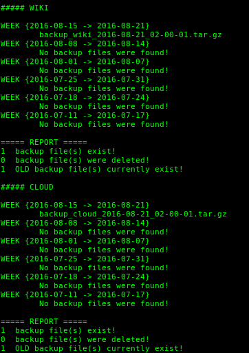

backup-script
=============

About
-----
This shell script backups the directories specified in the _CONFIGURATION SECTION_ 
by compressing and storing them. It is designed to be executed @midnight (same as
@daily) using Cron.

Details
-------
  - Every "\<token-uppercase\>\_BACKUP\_DAY" a backup is taken, unless a backup was
already taken this week.
  - If no backup was taken the previous week (Mon -> Sun) **AND**  if no backup
was taken this week, a backup is taken no matter what.
  -  Backups older than 5 weeks (counting current week) are deleted unless the
total number of backups is less than 6 (<=5).

Screenshots
-----------
<br>_Manual Execution_<br>



Configuration
-------------
The configuration section is the only section you should modify, unless you really(!)
know what you are doing!!!

Make sure to always comply with the name format of the example variables.
As you may have noticed, all variables related to each other begin with
the same token (i.e. WIKI, CLOUD, ...).

To add any additional directories to be backed up, you should only add three (3)
new lines and modify ${_TOKENS_} variable. See the examples below to get a better
understanding.

Example of ${_TOKENS_} variable:
```Shell
TOKENS="WIKI CLOUD"     # For any additional entry add the appropriate 
                        # <token-uppercase> separating it with a space
                        # character from existing tokens.
```

__Template__ - The three lines that should be added for every new directory addition.
```Shell
<token-uppercase>_BACKUPS_DIR="/path/to/dir"     # No '/' at the end of the path!
<token-uppercase>_DIR="/path/to/another-dir"     # No '/' at the end of the path!
<token-uppercase>_BACKUP_DAY="<weekday-3-letters>"
```

Example No.1
```Shell
WIKI_BACKUPS_DIR="/root/backups/wiki" # Where backup files will be saved.
WIKI_DIR="/var/www/html/wiki" # The directory that should be backed up.
WIKI_BACKUP_DAY="Sun" # The day of the week that the backup should be taken.
```

Execution (Cron)
----------------
Example cron entry:
```Shell
@midnight /root/bin/backup.sh
```

Licence
-------
[GNU GENERAL PUBLIC LICENSE // Version 3, June 2007](LICENSE)

Developer
--------
[George Z. Zachos](http://cse.uoi.gr/~gzachos)
